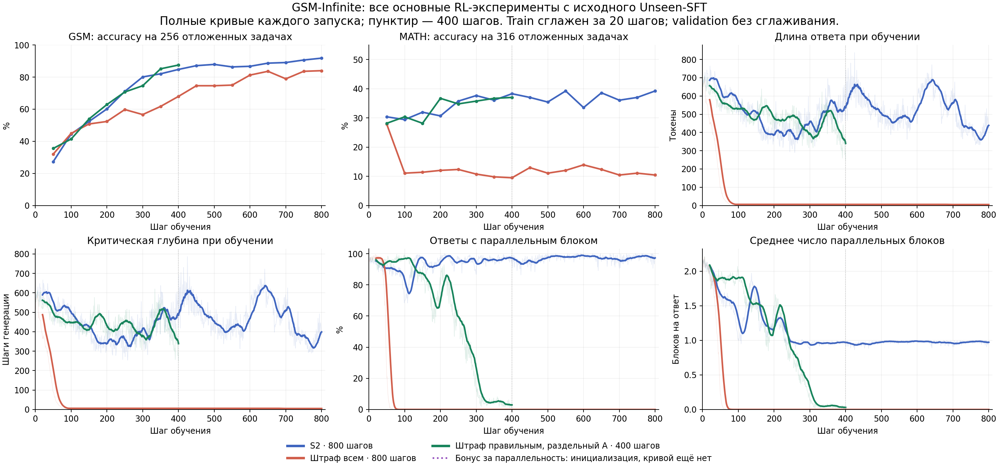
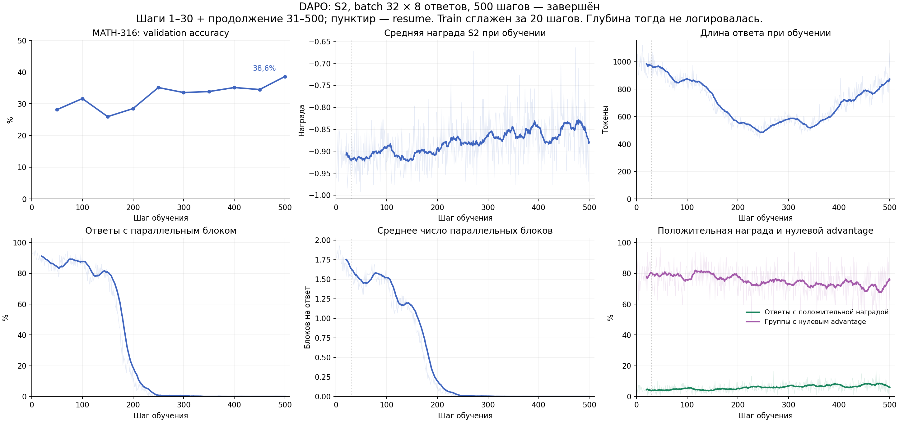

# Qwen3-0.6B RL experiments, October 7–8, 2026

Historical snapshot, not a live status page. Covers runs active after October 7,
16:00 MSK; the DAPO run began at 15:40. The last snapshot used for the two new
rewards is October 8, about 11:56 MSK. All training below uses batch32, n8 and
eight A100 GPUs, starting independently from original Unseen-SFT unless noted.

| Dataset / reward | Steps | Snapshot status | GSM held-out (256) | MATH (316) |
|---|---:|---|---:|---:|
| DAPO / S2 | 500 | Complete; resumed its own step30 | — | 122/316 (38.61%) |
| GSM-Infinite / S2 | 800 | Complete | 235/256 (91.80%) | 124/316 (39.24%) |
| GSM-Infinite / `c - 0.0001 D` | 800 | Complete | 215/256 (83.98%) | 33/316 (10.44%) |
| GSM-Infinite / `c - 0.0001 c D`, split advantage | 400 | Complete | 224/256 (87.50%) | 117/316 (37.03%) |
| GSM-Infinite / `c + 0.2 c v (1-D/T)`, split advantage | 0/400 | Initializing at snapshot time | — | — |

These are single-run, single-sample validation measurements, with unequal
training budgets and only 256/316 validation questions. They do not establish
statistical superiority. Training uses the legacy answer checker; dataset
screening below also audited a corrected checker, so the two score columns
should not be silently treated as the same protocol.

The unconditional depth penalty collapsed to answers of roughly five generated
tokens, with severe MATH degradation despite high GSM accuracy. Gating the cost
on correctness and splitting the advantage avoided that collapse in this run,
but did not preserve parallel blocks: at step400, GSM critical depth was 347.33,
parallel fraction 0.78%; MATH depth 651.48, parallel fraction 16.46%.
The bonus variant had no training curve yet in this snapshot.





Thin train curves are raw; thick curves use a trailing 20-step mean. Validation
points are unsmoothed. DAPO was logged without critical-depth telemetry; no
depth values have been inferred from response length.

## Dataset screening

Original Unseen-SFT, 256 questions per dataset, 8 samples/question (2048 total
answers each), October 7 at 21:20–22:20 MSK. “Mixed” means at least one correct
and one incorrect answer in the group of eight; it is not accuracy.

| Dataset | Audited accuracy | Mixed groups | Legacy/audited disagreements |
|---|---:|---:|---:|
| DAPO | 4.44% | 24.22% | 3/2048 |
| GSM-Infinite | 18.55% | 71.88% | 3/2048 |
| Big-Math Orca | 31.84% | 58.59% | 30/2048 |
| Big-Math CN K12 | 21.04% | 48.05% | 94/2048 |

GSM provides many mixed groups, but 61/256 gold answers are `4` (23.83%). Its
small answer vocabulary and shared templates make answer-frequency monitoring
and the separate MATH evaluation important. Orca has a broader answer
distribution; ratio-format grader disagreements need review before training.
No Orca or CN K12 training is claimed here.

## Data and artifact provenance

- GSM source: `InfiniAILab/gsm_infinite_medium_0` at
  `c6c5ab433565ddfe3e38e22be165b5c40e6bd576`, ops2–6, 4547 training rows.
- Big-Math screening mirror: `open-r1/Big-Math-RL-Verified-Processed` at
  `c79efbb6d3b75e3a2bcc27a5c569119918132345`, source `orca_math` or CN K12.
- Held-out: GSM256 plus MATH316, 572 rows per complete validation.
  MATH is evaluation-only. GSM evaluation questions are excluded from training.
- Preparation used normalized exact matching and number-masked trigram
  Jaccard>=0.65 against MATH/SFT exclusions. This is not proof of semantic
  decontamination; template overlap remains possible.
- Prepared parquet SHA256: train
  `9761c994eb5838177466616fe09d28eefbfeb8de31a7492e0916973556e4542b`;
  validation `28f380534762d90fd01015e68789d01c1a856cf157d28f508197fa35595603ec`.

Original artifact directories under the experiment root:

```text
rl-unseen-s2-bs32-500-20261007
rl-dataset-screen-20261007
gsm-unseen-two-rewards-20261008/{s2,depth}
gsm-unseen-split-rewards-400-20261008/{gated_depth,parallel_gain}
```

Three two-step GPU acceptance runs preceded the applicable production runs.
The proposed `gsm-unseen-efficiency-pilot-20261008` failed preflight and never
trained; it was replaced by the agreed 400-step pair. Raw logs, private model
weights, dataset files, server paths and deployment controllers are excluded
from Git. The figures are a fixed snapshot of those logs, not regenerated by
running tests. The [portable implementation and recipe](../efficiency-rl.md)
describe which code was promoted into this branch.
